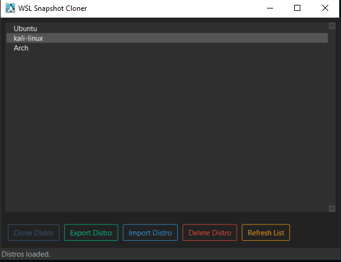

# WSLCloner



WSLCloner is a Windows application built using Python and PyQt5. It is designed to clone WSL (Windows Subsystem for Linux) environments and manage them efficiently. This document provides step-by-step instructions for setting up and building the application on a Windows environment.

## Prerequisites

Before starting, ensure you have the following installed on your Windows machine:

1. **Python 3.8 or later** (Download from [python.org](https://www.python.org/downloads/))
2. **Pip (Python package manager)** (Included with Python installation)
3. **Git** (Optional, for cloning the repository)

## Installation and Setup

1. **Clone the Repository** (or download it as a ZIP):
    ```bash
    git clone https://github.com/username/WSLCloner.git
    cd WSLCloner
    ```

2. **Create a Virtual Environment**:
    It is recommended to create a virtual environment to keep your dependencies isolated from other Python projects. Run the following commands:
    ```bash
    python -m venv env
    ```

3. **Activate the Virtual Environment**:
    Activate the newly created virtual environment. Depending on your system, use the appropriate command:

    - **Windows**:
      ```bash
      .\env\Scripts\activate
      ```


    You should see `(env)` at the beginning of your terminal prompt, indicating the virtual environment is activated. If you can use this command and rerun again.
    ```bash
    Set-ExecutionPolicy -ExecutionPolicy Bypass -Scope Process -Force
    ```

4. **Install Required Python Libraries**:
    Make sure all necessary Python libraries are installed. If a `requirements.txt` file is provided, run the following command:
    ```bash
    pip install -r requirements.txt
    ```

    Alternatively, you can manually install the main dependencies:
    ```bash
    pip install pyqt5 ttkbootstrap pillow
    ```

5. **Verify PyInstaller Installation**:
    Ensure that `pyinstaller` is installed in your virtual environment by running:
    ```bash
    pyinstaller --version
    ```
    If `pyinstaller` is not installed, install it using:
    ```bash
    pip install pyinstaller
    ```

6. **Build the Application**:
    Run the following command in the project directory to build the application:
    ```bash
    pyinstaller main.py --name=WSLCloner --onefile --windowed --icon=app_icon.ico --add-data "app_icon.ico;." --hidden-import ttkbootstrap --clean
    ```

    This command will create a standalone executable for the application in the `dist` folder.

7. **Run the Application**:
    Navigate to the `dist` folder and double-click the `WSLCloner.exe` file to start the application.

8. **Deactivate the Virtual Environment** (optional):
    After you are done working in the virtual environment, deactivate it by running:
    ```bash
    deactivate
    ```

## Command Explanation

The `pyinstaller` command used in step 6 includes the following options:

- `main.py`: The main entry point of the application.
- `--name=WSLCloner`: Specifies the name of the executable.
- `--onefile`: Creates a single bundled executable.
- `--windowed`: Prevents a console window from opening when the app is run.
- `--icon=app_icon.ico`: Sets the application icon.
- `--add-data "app_icon.ico;."`: Includes additional files such as the icon in the build.
- `--hidden-import ttkbootstrap`: Ensures that the `ttkbootstrap` library is included.
- `--clean`: Cleans up build artifacts before compiling.

## Troubleshooting

If you encounter any issues, ensure that:

- You are running the commands in a terminal with administrative privileges.
- All required dependencies are installed correctly.
- You are using the correct version of Python and `pyinstaller`.

## License

This project is licensed under the MIT License. See the [LICENSE](LICENSE) file for more details.

## Acknowledgements

- [PyInstaller](https://www.pyinstaller.org/)
- [PyQt5](https://riverbankcomputing.com/software/pyqt/intro)
- [ttkbootstrap](https://github.com/israel-dryer/ttkbootstrap)
